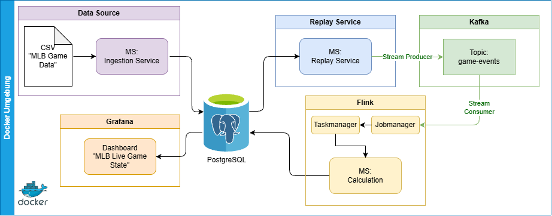

Projekt: Data Engineering (DLMDWWDE02)<br>
Jan Sauerland <br>
IU Internationale Hochschule

# Anleitung

### Voraussetzungen

- Docker Desktop

### Installation & Ausführung

1. Repository klonen
2. Docker Desktop starten
3. Im Projektverzeichnis das Terminal öffnen und folgenden Befehl ausführen:
   ```bash
   docker compose -f docker-compose.yaml -p dlmdwwde02 up -d
   ```
   Warten bis die Container gestartet sind und die Logs anzeigen, dass die Services laufen.
4. Für Start des Ingestion Service folgenden Befehl ausführen:
   ```bash 
    curl.exe -H "Content-Type: application/json" -X POST -d '{\"file_path\":null}' http://localhost:8000/start
   ```
   Warten bis die Logs anzeigen, dass der Ingestion Service gestartet und alle Daten verarbeitet wurden.
   Der aktuelle Stand der Verarbeitung kann in den Logs des Containers "mlb-ingest" nachvollzogen werden.
6. Grafana Dashboard öffnen:
    - URL: http://localhost:3000
    - Benutzername: admin
    - Passwort: admin (Nach erstem Login muss das Passwort geändert werden)
    - Dashboard: MLB Live Game State
7. PyFlink Job starten:
   ```bash
   docker exec dlmdwwde02-mlb-jobmanager-1 ./bin/flink run -py /opt/flink/usrlib/calc.py -d
   ```
   Warten bis die Logs anzeigen, dass der PyFlink Job gestartet wurde. Danach noch eine weitere Minute warten, damit der Job die Daten korrekt verarbeiten kann.
8. Replay Service starten:
   ```bash
   curl.exe -H "Content-Type: application/json" -X POST http://localhost:8001/start
   ```
   Warten bis die Logs anzeigen, dass der Replay Service gestartet wurde.
9. Für Stoppen des Replay Service folgenden Befehl ausführen:
   ```bash
   curl.exe -H "Content-Type: application/json" -X POST http://localhost:8001/stop
   ```
   Warten bis die Logs anzeigen, dass der Replay Service gestoppt wurde.

### Bekannte Probleme

- Wenn im ersten Event eines Innings keine Teams angegeben sind, wird der Eintrag in der Tabelle Innings ohne
  Team-Angaben gespeichert.
- Wenn zu schnell nach dem Job-Submit des PyFlink Jobs der Replay-Service gestartet wird, kann es passieren, dass sich der Job aufhängt. Im Fehlerfall musste bei mir immer die Docker Engine komplett beendet und neu gestartet werden. Danach konnten die Container wieder gestartet und die obigen Schritte ab dem PyFlink Job-Submit erneut ausgeführt werden.

# Beschreibung des Projekts

Das Projekt implementiert eine skalierbare Streaming-Datenpipeline für MLB-Spieldaten. Historische CSV-Daten werden in
PostgreSQL gespeichert, über einen Replay-Service als Echtzeit-Stream simuliert, mit Kafka verteilt und durch Apache
Flink verarbeitet. Die Ergebnisse werden in Grafana visualisiert. Containerisierung ermöglicht Zuverlässigkeit,
Wartbarkeit und horizontale Skalierung.

## Datenquelle

Als Datenbasis dient der öffentlich verfügbare Datensatz „MLB Game Data“
(https://www.kaggle.com/datasets/josephvm/mlb-game-data), der historische Baseball-Spiele der Major League Baseball
(MLB) enthält. Die Daten liegen in mehreren CSV-Dateien vor und bilden unterschiedliche Aspekte eines Spiels ab. Die
Datei Pitches.csv enthält einzelne Pitch-Ereignisse und verknüpft diese über Event-ID und Game-ID mit weiteren
Datensätzen. Events.csv beinhaltet die Spielereignisse eines Spiels, während Games.csv allgemeine Metadaten und
umfangreiche Spielstatistiken bereitstellt. Die verschiedenen Dateien bilden gemeinsam die Grundlage für die
Rekonstruktion und Analyse historischer Spielverläufe.

## Systemarchitektur

Ziel des Projekts ist die Entwicklung einer Streaming-Datenpipeline, die historische Spieldaten als Echtzeit-Datenstrom
simuliert. Die CSV-Daten werden zunächst über einen Ingestion-Service in eine PostgreSQL-Datenbank importiert und dort
als Rohdaten gespeichert. Ein Replay-Service liest die Ereignisse aus der Datenbank und gibt sie zeitlich geordnet als
Stream aus. Apache Kafka übernimmt die Verteilung der Events und entkoppelt dabei Datenquelle und Verarbeitung. Apache
Flink, welches über PyFlink eingebunden ist, verarbeitet die eingehenden Datenströme, berechnet den aktuellen Spielstand
und speichert die Ergebnisse in der PostgreSQL-Datenbank. Grafana visualisiert die aufbereiteten Daten in Form eines
Live-Dashboards. Die Beziehungen zwischen den einzelnen Komponenten und Datenflüssen sind in der Architekturabbildung
dargestellt. <br>
<br>


## Replay-Service

Der Replay-Service liest die Spielereignisse aus der PostgreSQL-Datenbank und gibt sie in zeitlich geordneter
Reihenfolge als Stream aus. Dabei werden die Events in der Reihenfolge ihrer Event-IDs verarbeitet, um die korrekte
Abfolge der Spielereignisse zu gewährleisten. Der Service simuliert die Echtzeitverarbeitung, indem er die Events mit
einer kurzen Verzögerung ausgibt, um die zeitliche Dynamik eines Spiels nachzubilden. Die Events werden in Kafka
veröffentlicht, sodass sie von anderen Diensten wie Apache Flink konsumiert werden können. Der Replay-Service
unterstützt die Wiederholung von Spielen, indem er die Events erneut abspielt, wodurch eine konsistente und
reproduzierbare Datenverarbeitung ermöglicht wird. <br>
<br>
Folgende Event-Typen werden vom Replay-Service unterstützt:

- game-start: Ein neues Spiel wird gestartet.
- inning-start: Ein neues (Halb-)Inning wird gestartet.
- pitch: Ein Pitch-Ereignis, das zu einem Event gehört.
- event: Ein Spielereignis, das nach den Pitches eines Events auftritt.
- inning-end: Ein (Halb-)Inning endet.
- game-end: Ein Spiel endet.

## Verarbeitung der Datenströme

Die Verarbeitung über Apache Flink funktioniert folgendermaßen:

1. Der aktuelle Spielstand wird von der Datenbank geladen, um die Verarbeitung mit dem letzten bekannten Zustand zu
   starten.
2. Je nach Event-Typ werden unterschiedliche Berechnungen durchgeführt.
    - game-start: Der Spielstand wird initialisiert und grundlegende Informationen wie Teams, Spielort und Datum werden
       gespeichert.
    - inning-start: Das aktuelle Inning wird aktualisiert und die Anzahl der Outs zurückgesetzt.
    - pitch: Die Anzahl der Pitches wird erhöht und die Pitch-Statistiken werden aktualisiert.
    - event: Der Spielstand wird basierend auf dem Spielereignis aktualisiert, z. B. bei einem Home-Run oder einem
       Strikeout.
    - inning-end: Das Inning wird abgeschlossen und die Anzahl der Outs wird zurückgesetzt.
    - game-end: Das Spiel wird abgeschlossen und der finale Spielstand wird gespeichert.
3. Der aktualisierte Spielstand wird wieder auf der Datenbank gespeichert, um den aktuellen Zustand für die nächste
   Verarbeitung zu sichern.

Somit kann pro aktivem Spiel nur eine Instanz des Flink-Jobs laufen, da eine parallele Verarbeitung inkonsistente Daten
zur Folge hätte.

## Anforderungen an Zuverlässigkeit und Skalierbarkeit

Die Zuverlässigkeit des Systems wird durch mehrere Mechanismen sichergestellt. Kafka puffert Daten dauerhaft, sodass
Consumer nach einem Neustart die Verarbeitung fortsetzen können. Rohdaten werden in PostgreSQL persistent gespeichert
und können bei Bedarf erneut abgespielt werden. Durch den deterministischen Replay-Service bleiben Datenströme
reproduzierbar. Zusätzlich ermöglichen Flink-Checkpoints die Wiederaufnahme der Verarbeitung nach einem Ausfall.
Eindeutige Event-IDs gewährleisten eine idempotente Verarbeitung und verhindern doppelte Ergebnisse. Für die
Skalierbarkeit können Kafka-Partitionen zur parallelen Verarbeitung mehrerer Spiele genutzt werden. Flink kann durch
zusätzliche TaskManager horizontal erweitert werden. Durch die Containerisierung mit Docker können einzelne Dienste
unabhängig voneinander skaliert und betrieben werden.

## Wartbarkeit, Sicherheit und Governance

Die Architektur folgt dem Prinzip der Single Responsibility: Jeder Dienst erfüllt genau eine klar abgegrenzte Aufgabe.
Die lose Kopplung über Kafka erleichtert die Erweiterung um zusätzliche Analyse- oder Verarbeitungsdienste. Einheitliche
Datenmodelle und Monitoring-Möglichkeiten für Kafka, Flink und PostgreSQL unterstützen den langfristigen Betrieb. Da
ausschließlich öffentliche Sportdaten verarbeitet werden, entstehen nur geringe Datenschutzanforderungen. Dennoch wird
das Prinzip der Datenminimierung umgesetzt, und Zugriffe auf Datenbanken werden rollenbasiert geregelt. Grafana erhält
ausschließlich lesenden Zugriff. Zur Datensicherheit trägt die Isolierung durch das Docker-Netzwerk bei. Eine
nachvollziehbare Datenherkunft, Qualitätsprüfungen beim CSV-Import und klar definierte Kafka-Nachrichtenschemata
gewährleisten darüber hinaus eine solide Data-Governance-Struktur.
